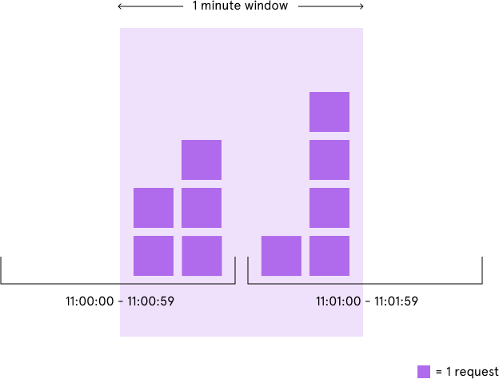
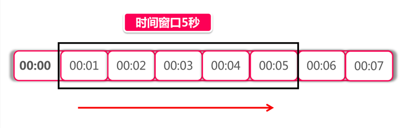
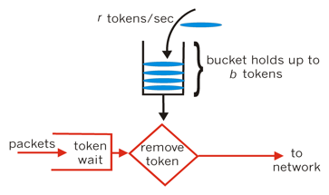

# 熔断器

包 `github.com/tal-tech/go-zero/core/break 提供了一个熔断器的接口和两套实现。


### 什么是 熔断器？

服务端经常会面临的一个问题是服务器负载过高，比如某个热点新闻导致流量短时间激增，这个时候如果不做相应的保护，服务端可能发生宕机导致直接不可用。处理这种情况一般会：

- 服务降级：比如返回静态数据
- 服务熔断：对部分请求直接返回服务不可用，对其他请求继续提供服务


熔断器就是完成熔断功能的组件。它应该决定是否为当前请求提供正常服务，还是直接拒绝。


### go-zero熔断器的实现

#### 接口定义

```go
type (
  // 判断一个错误返回是否依旧是成功的
	Acceptable func(err error) bool

	Breaker interface {
		// Name returns the name of the netflixBreaker.
		Name() string

    // 判断请求是否被允许
    // 如果允许，调用方需要在调用成功后调用 promise.Accept(),失败后调用 promise.Reject
    // 如果不被允许（限流了），返回的是 ErrServiceUnavailable
		Allow() (Promise, error)

		// DoWithFallbackAcceptable 
    // - 在未被限流时执行req
    // - 被限流时执行fallback（回退）
		// - acceptable 检查 req 是否调用成功，即便req返回的err不是nil
		DoWithFallbackAcceptable(req func() error, fallback func(err error) error, acceptable Acceptable) error
    
		// DoWithFallbackAcceptable 的简化版
    // acceptable 为 err == nil
		DoWithFallback(req func() error, fallback func(err error) error) error
    
		// DoWithFallbackAcceptable 的简化版
    // fallback 逻辑为：nil 不做回退
		DoWithAcceptable(req func() error, acceptable Acceptable) error

    
		// DoWithFallbackAcceptable 的简化版
    // acceptable 为 err == nil
    // fallback 逻辑为：nil 不做回退
		Do(req func() error) error
	}
)
```


可以看见，类库实现的Breaker里面本质上只有两个接口：

```go
// 判断是否被限流
Allow() (Promise, error)

// 确定是否被限流
// - 如果限流了就执行 fallback
// - 如果没有限流就执行 req，使用 acceptable 确定是否执行成功，来执行后续的行为（本质上是Promise）
DoWithFallbackAcceptable(req func() error, fallback func(err error) error, acceptable Acceptable) error
```


#### 功能实现原理

实现是参考了[Google的方案](https://landing.google.com/sre/sre-book/chapters/handling-overload/)。先对方案进行阐述：

A通过调用Redis完成自身业务，因为Redis的负载是有限的，一般会和A协商好Redis对A的容量，如果超限了就拒绝对A的调用。

这里面有个问题，拒绝服务会耗用资源，比如：

- 如果提供服务的代价比拒绝服务的代价还要小
- 如果请求太多了，拒绝本身也很昂贵

Google给出个他们实践下来效果良好的方案`自适应限流`：在Redis被访问时（这个逻辑A中调用，但是由Redis客户端类库提供）Redis客户端库自己会在Redis服务拒绝后开始按一定比例直接丢弃A对Redis的请求（连网络请求都不发送）。

丢弃的概率为： `max(0, (一段时间内的请求总数 - K * 一段时间内的请求被正常处理数) / (一段时间内的请求总数 + 1) )`

其中K是一个变量，举个例子，当K = 1 时，一个请求会有 (被拒绝的数量 / 总数量) 的概率直接被拒绝，假设Redis能处理 200 个请求：

1. 当请求数量为200时，被拒绝的概率是0，被处理的数量为200
2. 当请求数量为400时，Redis服务端会拒绝200个请求，可以得到被拒绝的概率是0.5，这时候类库会开始将200个请求直接丢弃掉，下一刻又回到 状态1

这是个静态的估计，实际中请求总数是动态变化的，被拒绝的数量也是变化的。

K的含义是：K越大，被拒绝的概率就越小，后端的压力就会越大。


Google使用K=2，期望服务端能够正常处理请求。


注意，这个算法在零星请求的情况下表现得不好，当请求量开始增加时，服务端的反馈会感觉过慢。

#### 功能实现细节

知道了原理，实现细节就很好理解了。

```go
func (b *googleBreaker) accept() error {
  // 从 RollingWindow 中得到当前的情况
	accepts, total := b.history() 
  // k = 1.5
	weightedAccepts := b.k * float64(accepts)
  
  // protection = 5,做预留了,得到丢弃概率
	// https://landing.google.com/sre/sre-book/chapters/handling-overload/#eq2101
	dropRatio := math.Max(0, (float64(total-protection)-weightedAccepts)/float64(total+1))
  
  // 丢弃概率为0，确保当前的限流状态是关闭的
	if dropRatio <= 0 {
    // 直接返回 接受请求
		return nil
	}
  
  // 按概率进行丢弃
	if b.proba.TrueOnProba(dropRatio) {
		return ErrServiceUnavailable
	}

	return nil
}
```


### 延展

限流器处理Google的这个自适应的解决方案，还包括几个经典的方案：

- 固定窗口：最直接的解决方案，计算周期内总数，超了就限流
  
  - 计数周期太大会导致误差，比如周期为1秒，那么在1秒内相隔的两毫秒的流量可以是最大限流的两倍
  
  
  
- 滑动窗口：是计数器的升级版，将计算周期减小，使用多个计数器



- 令牌桶：令牌已一定的速度落入桶里面，请求过来时拿一个，如果没拿到就是被限流了



- 漏斗：将所有的请求排队，从漏斗里面一一出来

